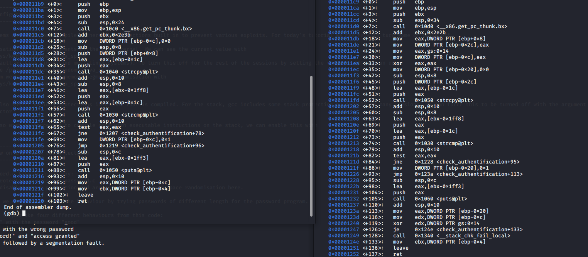

# Solutions TP 4

## 4.2
This is exactly the code given in the slides. The critical part is the following:
```c
int auth_flag = 0;
char password_buffer[16];
strcpy(password_buffer,password);
```

So we see we have a buffer of length 16 and just "above" a variable which given us access to a critical section.
We can do 3 differents things:
1. put a password of length < 16: unless we found the right password, this will give us a "bad password!".
2. put a password of length > 16 && length < 25: this will give us a "bad password!" but as we have rewrite the auth_flag this will also give us a "access granted"
3. put a password of length > 25 this will give us "bad password!" and then "seg fault" as we've gone to far and also rewrite the saved eip

## 4.3
Here we have the same code as 4.2 but with a stack protector. So if we try a password longer than 16 we get a "stack smashed detected aborted"
If we compare the 2 different code in gdb and more specially the **check_authentification** we can see the difference between the 2 code. 


We can see on the picture above, that the right code (which is the one with the protection) is bigger than the left code. 
Then we notice on the right code at address **0X000011e1** that we put something on eax. This something is a random value generated from a gs register.
Then this random value will be put on the stack and this will become the protection also known as canari(see following lectures).

## 4.4
Here we have to manner to find how to do an infinite loop:
1. only look at the assembly
2. also look at the source code

If we look at the source code the vulnerability is found easily. 
Indeed we see in the following code the vulnerability:
```c
 int i;
 char buf[16];
 for (i=0;i<=16;i++)
```
We have a buffer of length 16 but in the foor loop we can copy 17.
So we are able on the last caracter to rewrite the value of i and then to start again and again the for loop.
we can also find this by lookting at the assembly:
0x004011a0: jmp to func+50. After that, the compiler is comparing a value of i with 16 and then jump back to 0x00401199 <+16>: movl $0x0,-0x4(%ebp)

Here is the asssembly: __:
 0x00401189 <+0>: push %ebp
 0x0040118a <+1>: mov %esp,%ebp
 0x0040118c <+3>: sub $0x20,%esp
 0x0040118f <+6>: call 0x4011ea <__x86.get_pc_thunk.ax>
 0x00401194 <+11>: add $0x2e6c,%eax
 0x00401199 <+16>: movl $0x0,-0x4(%ebp) //init i =0
 0x004011a0 <+23>: jmp 0x4011bb <func+50> //jump to +50 
 0x004011a2 <+25>: mov -0x4(%ebp),%edx
 0x004011a5 <+28>: mov 0x8(%ebp),%eax
 0x004011a8 <+31>: add %edx,%eax
 0x004011aa <+33>: movzbl (%eax),%eax
 0x004011ad <+36>: lea -0x14(%ebp),%ecx
 0x004011b0 <+39>: mov -0x4(%ebp),%edx
 0x004011b3 <+42>: add %ecx,%edx
 0x004011b5 <+44>: mov %al,(%edx)
 0x004011b7 <+46>: addl $0x1,-0x4(%ebp)
 0x004011bb <+50>: cmpl $0x10,-0x4(%ebp) //compare the value of i with 16
 0x004011bf <+54>: jle 0x4011a2 <func+25> //if i<=16 , jump again at +16
 0x004011c1 <+56>: nop
 0x004011c2 <+57>: nop
 0x004011c3 <+58>: leave
 0x004011c4 <+59>: ret 

0x4(%ebp)is where the value of i is stored. If we put a 16 char's input, the last iteration of the for loop will overwrite
i's value with the null character (all bits of this char are set to 0), which is the next value on the stack. (if we look at the
code, i is declared just before the buffer).
 
 The cmp instruction : (i<=16) will always be true, because each time we reach str[16] = ptr[16], we will set i's value
to 0 so the condition is always true, we will be stuck in an infinite loop. the compilation with clang leads to an infinite loop too. A way to secure the code is to use the -fstack-protector or to put the value of i further from the buffer in the code.

## 4.5
We have a program that contains a main function calling a foo function()
 Foo is using strcpy to copy the content of an array into another.
 We will use GDB to locate some important values : EIP and the buffer size.
 -gdb -q loop
We run run the main function and disass the foo function because in order to find its return value (saved eip, because we want to change it by a value that points to an address which would create a loop)
we set a breakpoint right after the call of strcpy (in foo) in order to see what was copied.

The main idea here is to find the size of the buffer and find the saved eip address of foo:
 We re-run the code after having set the breakpoint.
to find the saved eip we type:
 "info frame" or "x $eip"

we get :
 Stack level 0, frame at 0xbffff2b0:
 eip = 0x4011db in foo (loop.c:10); saved eip = 0x40122e
 called by frame at 0xbffff2f0
 source language c.
 Arglist at 0xbffff2a8, args: buffer=0x405160 '\220' <repeats 38 times>
 Locals at 0xbffff2a8, Previous frame's sp is 0xbffff2b0
 
The value that interest us is : saved eip = 0x40122e , we will have to modify this value with the address of our choice.
then , to know the buffer size ( we can simply check in the code but , that's another way to find it)
 -x/24xw newbuffer

the first x for "examine", 24 for the quantity of data, second x means hexadecimal and w means words. so we want
to examine the 24 words at the position of the newbuffer in memory (on the stack).

We get __:
 0xbffff2b0: 0x90909090 0x90909090 0x90909090 0x90909090
 0xbffff2c0: 0x90909090 0x90909090 0x90909090 0x90909090
 0xbffff2d0: 0x00405100 0x00404000 0xbffff308 0x0040122e
 0xbffff2e0: 0x00405160 0xffffff90 0x00000020 0x004011fb
 0xbffff2f0: 0x00000002 0xbffff3b4 0xbffff3c0 0x00405160
 0xbffff300: 0xbffff320 0x00000000 0x00000000 0xb7dff7e1
 
 x90 is a NOP instruction, 0xbffff308 seems to be the ebp value and 0x0040122e is the eip value that we want to
overwrite.In order to know the size of the buffer, we simply subtract 0xbffff2d0 - 0xbffff2b0 and we get 32 (in
decimal). We see 8 more bytes stored
 that we can overwrite too. At this point, we are free to change EBP and EIP values.
 We now have to change the 0x0040122e by 0x0040124d (the address of the call of foo). Here the solution to
reach the saved EIP :

```
#include "stdlib.h"
#include "string.h"
// YOU CAN CHANGE THIS VALUE!
#define TARGET 48
void foo(char * buffer){
 char newbuffer[32];
 strcpy(newbuffer, buffer);
}
int main() {
 char * buffer;
 buffer = malloc(sizeof(char)*TARGET);
 memset(buffer, '\x90',TARGET);
 buffer[44]=0x4d;
 buffer[45]=0x12;
 buffer[46]=0x40;
 buffer[47]=0x00;
 foo(buffer);
return 0;
}

```
## 4.6
In this program , we can find two errors :
The amount of byte copied is always the same (256) despite the real number of bytes written as input (ex, if I
write a string containing 50 bytes).
 secàondly, the for loop condition is wrong because it has 257 rounds of copy. The buffer only has 256 bytes ,
moving the least significant byte of what follows it immediately in the memory (the ebp value stored by main).
 The way to exploit this is to overwrite saved ebp in order to make it pointing to an address located inside the
buffer.

Here is the stack representation :
 ________________________ -> esp
 | int i                |
 |-------------------- -|
 | buffer[256]          |
 |----------------------| -> ebp of func()
 |saved ebp main        |
 |--------------------- |
 | saved eip main       |
 |----------------------|
 |                      |
 |                      |
 |     STACK            |
 |                      |
 ────────────────────────
 
 if we write enough " A" char on the buffer (256), we would be able to reach the saved EBP with the null char
(because 257 iterations of "copy" are done). If EBP is altered, the ret instruction at the end of func will load the eip
value from another location and not the original.
Instead of putting A's in the return address, we will fill eip with the address of the shellcode we'll put in the buffer,
for example
As argument , we can put :
 1) x * "\x90" of nop instructions, where X is the offset between the address of the beginning of our buffer and the
address of the new EBP (set earlier).
 2) after this, we will fill the new EBP value (because it is now located inside the buffer) with 4 more "\x90" bytes. =>
+ 'x\90'x4
 3) at this point, we will overwrite the new EIP that is located next to the new EBP, with the address of the shellcode
in the stack
 4) finally we have to write the shellcode itself and fill the remaining bytes with "\x90"'s
the exploit is done, just need to execute.
 (remember to disable randomisation of memory segments by linux or to compile with the -g flag if this doesn't
work)
If you use gcc, this will not work because of the leave instruction that does “mov ebp, esp” and then “pop ebp”.This
instruction will change the EBP we set and the exploit will be canceled. Gcc uses it, but clang does not.

detailed solution at : https://www.welivesecurity.com/2016/05/10/exploiting-1-byte-buffer-overflows/

## 4.7
Nothing to explain all is in the instruction.

## 4.8
First of all you have to notice that we have a function call to function func.
So we have different step to go through before spawning a shell.
1. find the value of ebp/eip before the function call
To do so we but a breakpoint just before the call to the function call and we print the value of ebp/eip with the command **i r** and you have to remember it.
2. find the size we have before touching ebp/eip.
To do so we put a breakpoint in the function **func** just after the call to **strcpy**.
then we print the stack (**x/40wx $esp**) and search for the value we've found at step 1 for ebp and eip.
you can see the result on the following picture (the value might be different for you).

3. Calculate the size before touching ebp/eip
Now we have to calculate how much bytes we have before touching ebp/eip. In this case we have 72 bytes before touching ebp and then 76 before touching eip.
4. Calculate number of NOP instruction
At the begining of our buffer we will put NOP instruction. So we have to know how much.
To do so we have to know the size of our shellcode. In this case if you used the same as 4.7 it's 55 bytes long.
So we know that before touching eip we have to put 76 bytes.
We can thus calculate the number of NOP instruction(**\x90**) 76-55=21
4. Rewrite eip with our adress in the NOP instruction. Personally i used **0xbffff218** but any address inside the NOP can be used.
5. Run gdb with this handcraft argument
you can see how to run the code in gdb with this argument on the following picture

6. you made it
congratulation you've spawned a shell
    
