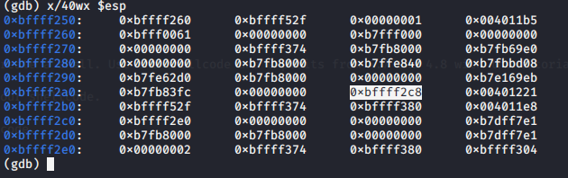
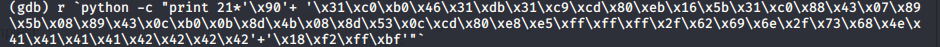
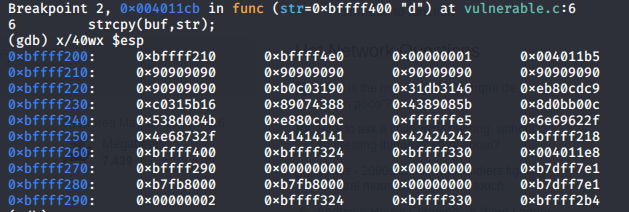

# Solutions TP 4

## 4.2
This is exactly the code given in the slides. The critical part is the following:
```c
int auth_flag = 0;
char password_buffer[16];
strcpy(password_buffer,password);
```

So we see we have a buffer of length 16 and just "above" a variable which given us access to a critical section.
We can do 3 differents things:
1. put a password of length < 16: unless we found the right password, this will give us a "bad password!".
2. put a password of length > 16 && length < 25: this will give us a "bad password!" but as we have rewrite the auth_flag this will also give us a "access granted"
3. put a password of length > 25 this will give us "bad password!" and then "seg fault" as we've gone to far and also rewrite the saved eip

## 4.3
Here we have the same code as 4.2 but with a stack protector. So if we try a password longer than 16 we get a "stack smashed detected aborted"
If we compare the 2 different code in gdb and more specially the **check_authentification** we can see the difference between the 2 code. 
[difference between 4.2 and 4.3](img/diff_43-42.png)

We can see on the picture above, that the right code (which is the one with the protection) is bigger than the left code. 
Then we notice on the right code at address **0X000011e1** that we put something on eax. This something is a random value generated from a gs register.
Then this random value will be put on the stack and this will become the protection also known as canari(see following lectures).

## 4.4
Here we have to manner to find how to do an infinite loop:
1. only look at the assembly
2. also look at the source code

If we look at the source code the vulnerability is found easily. 
Indeed we see in the following code the vulnerability:
```c
 int i;
 char buf[16];
 for (i=0;i<=16;i++)
```
We have a buffer of length 16 but in the foor loop we can copy 17.
So we are able on the last caracter to rewrite the value of i and then to start again and again the for loop.

## 4.5
all it's clearly explain in the slide.

## 4.6
Do know exactly what to search

## 4.7
Nothing to explain all is in the instruction.

## 4.8
First of all you have to notice that we have a function call to function func.
So we have different step to go through before spawning a shell.
1. find the value of ebp/eip before the function call
To do so we but a breakpoint just before the call to the function call and we print the value of ebp/eip with the command **i r** and you have to remember it.
2. find the size we have before touching ebp/eip.
To do so we put a breakpoint in the function **func** just after the call to **strcpy**.
then we print the stack (**x/40wx $esp**) and search for the value we've found at step 1 for ebp and eip.
you can see the result on the following picture (the value might be different for you).

3. Calculate the size before touching ebp/eip
Now we have to calculate how much bytes we have before touching ebp/eip. In this case we have 72 bytes before touching ebp and then 76 before touching eip.
4. Calculate number of NOP instruction
At the begining of our buffer we will put NOP instruction. So we have to know how much.
To do so we have to know the size of our shellcode. In this case if you used the same as 4.7 it's 55 bytes long.
So we know that before touching eip we have to put 76 bytes.
We can thus calculate the number of NOP instruction(**\x90**) 76-55=21
4. Rewrite eip with our adress in the NOP instruction. Personally i used **0xbffff218** but any address inside the NOP can be used.
5. Run gdb with this handcraft argument
you can see how to run the code in gdb with this argument on the following picture

6. you made it
congratulation you've spawned a shell
    
