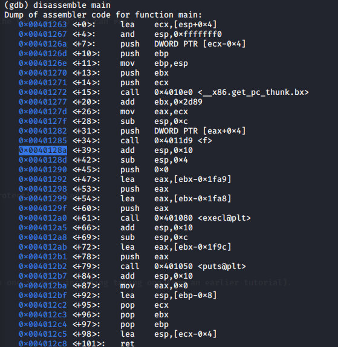
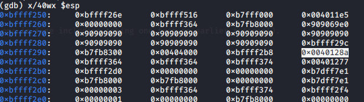
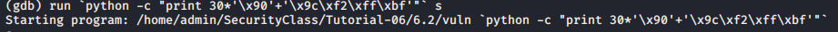

# Solution TP6

## 6.2
The idea is the following:
1. As pointer p follow the char array a, a BO on a will rewrite the value of p and so the address point by p.
 So first of all we need to find the address of **saved eip**. To do that:
	* remember the address of the instruction just after the call of **f**. In my case this address is shown on the follong figure

	* break in **f** where you want (personaly i break just before the first **strcpy**. Then show the stack and spot the **saved eip**. 

	* calcul the address of this **saved eip**
	in my case it's: 0xbffff290 + 0xc = 0xbffff29c
2. we will put the address of **saved eip** in p so that the second **strncpy** will rewrite the value of **saved eip**. To do so we only have to do a **BO** with 30 charactere and then put the adress of **saved eip**. You can see the command on the following pictures

You can break after the **strncpy** and see that the value of eip was rewritten with your second argument.

3. with the second **strncpy** we can write any address we want in **saved eip** so that we can return to our shellcode for example. So now the second argument has to be address of the shellcode or with wathever address you want.

> :warning: for now that's only the concept of the attack because the length of the buffer a (30 bytes) is too small to contain the shellcode (55 bytes) given in the previous TP 

 
